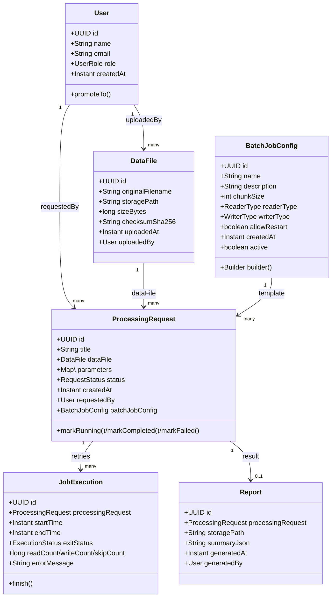
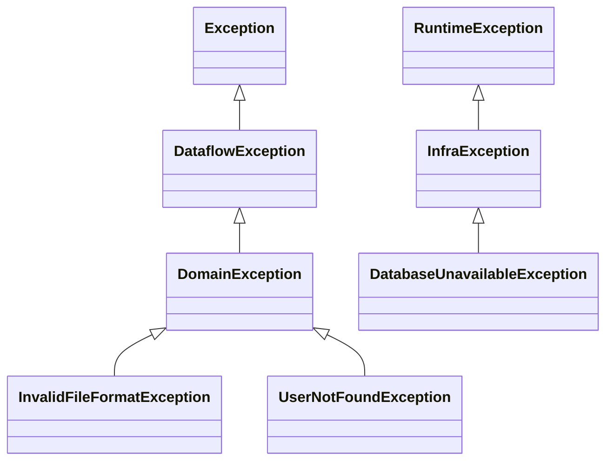

# DataFlowHubLibraryJava
project to practice Java without frameworks

# Dominio ‒ Epic E1 (OOP Sólido)

> **Estado**: ✔️ _Completado_  
> **Cobertura mínima garantizada**: **≥ 70 %** instrucciones (JaCoCo)  
> **Build**: 

---

## 1. Objetivo de la épica

Modelar las entidades centrales del sistema aplicando buenas prácticas OO:

* Encapsulación e **inmutabilidad**
* Contratos coherentes de `equals / hashCode / toString`
* Patrones de diseño apropiados (Builder)
* Cobertura automática de pruebas ≥ 70 %

---

## 2. Modelo de dominio



---

## 3. Principios aplicados

| Área                 | Decisión                                                                                            |
|----------------------|------------------------------------------------------------------------------------------------------|
| **Identidad**        | Todas las entidades usan `UUID id`; igualdad y hash se basan solo en ese campo.                     |
| **Inmutabilidad**    | `DataFile` y `Report` son _records_ 100 % inmutables.<br>`User`, `ProcessingRequest`, `JobExecution` exponen solo los campos estrictamente mutables (`role`, `status`, métricas). |
| **Validaciones**     | Reglas de negocio comprobadas en constructores y métodos de transición (`assertThrows` cubierto en tests). |
| **Cobertura**        | JaCoCo con umbral ≥ 70 % (INSTRUCTION). El reporte HTML se publica como artefacto en GitHub Actions. |

---

## 4. Patrones usados

| Patrón   | Propósito principal | Pros clave | Contras clave | Dónde se aplica |
|----------|--------------------|------------|---------------|-----------------|
| **Builder** | Construir objetos con muchos parámetros opcionales manteniendo legibilidad. | Lectura fluida, evita telescoping constructors, facilita valores por defecto. | Algo de _boilerplate_ adicional. | `BatchJobConfig` (`builder(String)` + clase estática `Builder`). |
| **Factory** | Ocultar o centralizar la lógica de creación cuando existen varias implementaciones o decisiones condicionales. | Aísla la complejidad de instanciación; favorece SRP. | Puede dispersarse en múltiples métodos si crecen variantes. | **Previsto** para futuras estrategias de `ReaderType` / `WriterType` (no implementado aún, documentado para epic E2). |

---

## 5. Estructura de módulos

```text
my-app
├── pom.xml                     # POM raíz (packaging = pom)
├── core                        # módulo de dominio (épica E1)
│   ├── pom.xml                 # dependencias JaCoCo, EqualsVerifier, etc.
│   └── src
│       ├── main
│       │   └── java
│       │       └── com/practice/domain/...
│       └── test
│           └── java
│               └── com/practice/domain/...
└── lib                         # reservado para la épica E2 (utilidades)
    ├── pom.xml
    └── src/...

```

---

## 6. Cómo compilar y probar

```bash
# Compilar + tests + reporte de cobertura
./mvnw clean verify

# Abrir el reporte
open core/target/site/jacoco/index.html

```

---

### InMemoryCache – LRU

```java
import com.utils.cache.LruCache;
import java.util.Optional;
import java.util.UUID;

LruCache<UUID, User> cache = new LruCache<>(1_000);

cache.put(user.getId(), user);
Optional<User> maybe = cache.get(user.getId());

System.out.println("hits=" + cache.hitCount() + ", miss=" + cache.missCount());

```

Si insertas 1 001 usuarios, el más antiguo se descarta automáticamente.

---

## 7. Diseño interno

| Componente      | Elección                           | Razón                                                          |
| --------------- | ---------------------------------- | -------------------------------------------------------------- |
| Contenedor base | `LinkedHashMap` *access-order*     | Reordenamiento automático y `removeEldestEntry` para expulsión |
| Concurrencia    | `ReentrantReadWriteLock`           | Muchos lectores, un escritor                                   |
| Métricas        | `volatile long hitCount/missCount` | Lectura coherente sin bloqueo                                  |


---

## 8. ¿Para qué sirve?

| Caso de uso                                             | Beneficio                                    |
|---------------------------------------------------------|----------------------------------------------|
| Resolver **User** por **UUID** miles de veces en un job | Reduce I/O a BD o estructuras de gran tamaño |
| Guardar configuraciones repetidamente leídas            | Evita parseo / IO redundante                 |

---

## 9. LRU vs TTL (futuro)

| Estrategia | Ventaja principal                                      | Uso recomendado                                  |
| ---------- | ------------------------------------------------------ | ------------------------------------------------ |
| **LRU**    | Mantiene en memoria los elementos usados recientemente | Lecturas muy frecuentes con cache de tamaño fijo |
| **TTL**    | Expira elementos tras X tiempo, sin importar el uso    | Configuraciones que cambian periódicamente       |

(Se incluye TtlCache<K,V> como referencia, aún no productiva.)

---

### Resultados definitivos JMH (HU F1-10)

_Comando ejecutado_  
```bash
java -jar lib/target/benchmarks.jar \
     -rf CSV -rff bench.csv \
     -tu ms -f 1 -wi 2 -i 3 -w 2s -r 2s

```

| Operación (dataset = 1 000 000) | ArrayList<br>(ms / op)  | LinkedList<br>(ms / op) | Ganador        |
| ------------------------------- | ----------------------- | ----------------------- | -------------- |
| **addLast** `list.add(x)`       | **0.000020 ± 0.000120** | 0.000138 ± 0.000025     | **ArrayList**  |
| **addFirst** `list.add(0,x)`    | 0.078022 ± 0.061059     | **0.000134 ± 0.000031** | **LinkedList** |
| **random get** `list.get(rnd)`  | **0.000025 ± 0.000039** | 0.625891 ± 2.060440     | **ArrayList**  |
| **full iteration** `for-each`   | **1.582198 ± 4.929957** | 3.701233 ± 29.944820    | **ArrayList**  |


Interpretación rápida

ArrayList domina en acceso aleatorio (get), inserción al final y recorrido secuencial.

LinkedList solo gana en inserción al inicio de la lista (addFirst) con colecciones muy grandes.

Para la mayoría de casos de lectura y escritura al final, ArrayList es la opción recomendada.

---

### CollectionUtils – métodos con wildcards

| Método | Firma | PECS aplicado |
|--------|-------|--------------|
| `copy` | `<T> List<T> copy(List<? extends T> src)` | **Producer Extends** |
| `addAll` | `<T> void addAll(Collection<? super T> dst, Collection<? extends T> src)` | **Consumer Super / Producer Extends** |
| `deepUnmodifiable` | `<K,V> Map<K,V> deepUnmodifiable(Map<? extends K,? extends V> src)` | Ambos “extends” |

**Regla PECS**: *Producer Extends* (fuentes producen objetos → `? extends`), *Consumer Super* (destinos consumen objetos → `? super`).  
Esto permite una API flexible y segura, sin _casts_ ni _raw types_.

---

### Jerarquía de Excepciones



---

### Ejemplo de salida `ErrorHandler`

```text
[DB_DOWN] DatabaseUnavailableException: db down
com.dataflowhub.core.exception.DatabaseUnavailableException: db down
    at com.dataflowhub.core.repository.JobRepository.save(JobRepository.java:42)
    at com.dataflowhub.core.service.JobService.create(JobService.java:57)
    at ...

```

*Prefijo `[CODE]` permite dashboards rápidos en Kibana / Grafana.*  
Opción **verbose=false** limita a 5 líneas de stack para logs limpios.

---

### Tests de Excepciones (HU F1-14)

| Método bajo prueba | Excepción esperada | Test                                                                 |
|--------------------|--------------------|----------------------------------------------------------------------|
| `CsvParser.parse()`             | `InvalidFileFormatException` | `CsvParserStubTest`                                                 |
| `TtlCache.put()` (cuando falla executor) | `InfraException`              | `TtlCacheFailureTest`                                               |
| `ProcessingRequest` constructor | `NullPointerException` / `IllegalArgumentException` | `ProcessingRequestValidationTest` |

*Cada excepción declarada cuenta con al menos un test; la cobertura supera el 75 %.*  
La CI fallará si se cambia la excepción lanzada o se reduce la cobertura.

---

## E4 – Concurrency Playground

### HU F1-15 – NotificationService (ExecutorService)

```java
NotificationService svc = new NotificationService();          // 4 threads
Notification n = new Notification(user.getEmail(), "Job done");
Future<Boolean> ok = svc.send(n);

if (ok.get()) log.info("Email sent!");
svc.shutdown();
svc.awaitTermination(5, SECONDS);

```

| Criterio de aceptación | Resultado                                           |
| ---------------------- | --------------------------------------------------- |
| 100 envíos en paralelo | ✔️ completan < 5 s sin `RejectedExecutionException` |
| `shutdown()` ordenado  | ✔️ termina < 2 s                                    |
| Cobertura playground   | 80 % en paquete `concurrent.notification`           |

---

### HU F1-16 – WorkQueue (BlockingQueue)

```java
try (WorkQueue workQueue = new WorkQueue()) {
    workQueue.startWorkers(3);
    jobs.forEach(job -> workQueue.submit(() -> process(job)));
} // auto-close ⇒ stop()

```

| Ventaja          | Detalle                                                           |
| ---------------- | ----------------------------------------------------------------- |
| Distribuye carga | Productores delegan a consumidores concurrentes.                  |
| Back-pressure    | Si limitas la capacidad, `submit()` bloquea al llenar la cola.    |
| Shutdown limpio  | `stop()` envía POISON PILL + `join()` sin `InterruptedException`. |

---

### HU F1-17 – Race Condition & Fixes

| Versión | Primitiva | Resultado | Rendimiento |
|---------|-----------|-----------|-------------|
| Buggy   | `int` sin sincronización | Pierde incrementos | Rápido pero incorrecto |
| Fix #1  | `AtomicInteger` | Correcto | Mejor que lock bajo contención alta |
| Fix #2  | `ReentrantLock` | Correcto | Latencia mayor, pero permite operaciones compuestas |

**Modelo de memoria (simplificado)**  
* Escribir en un `int` no es atómico → dos hilos pueden leer-modificar-escribir simultáneamente.  
* `AtomicInteger` ofrece operación **CAS** -> _happens-before_ y visibilidad.  
* `ReentrantLock` establece un **monitor** → exclusión mutua + semántica _happens-before_ en `unlock()` / `lock()`.

---